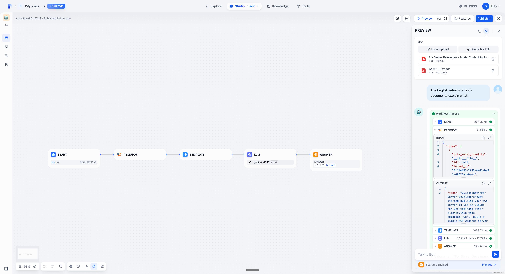

# PyMuPDF Plugin for Dify

A powerful PDF text extraction plugin for Dify powered by PyMuPDF (aka fitz).



## Overview

PyMuPDF Plugin is a high-performance tool that allows you to extract, analyze, and manipulate text content from PDF documents directly within Dify applications. Built on the robust PyMuPDF library, this plugin provides accurate and efficient PDF text extraction capabilities.

## Features

- Extract complete text content from PDF files
- Process single or multiple PDF documents simultaneously
- Maintain page structure with clear page separations
- Return both human-readable text and structured JSON data
- Detailed metadata including page numbers and file information

## Installation

To install the PyMuPDF Plugin:

1. Navigate to the Plugin section in your Dify application
2. Click "Add Plugin"
3. Search for "PyMuPDF" or upload this plugin package
4. Follow the on-screen instructions to complete installation

## Requirements

- PyMuPDF library (installed automatically with the plugin)
- Compatible with Dify plugin system

## Usage

Once installed, the plugin can be accessed through the Dify interface:

1. Upload one or more PDF files using the file selector
2. The plugin will process each file and return:
   - Text content extracted from all pages
   - Structured JSON data with page-by-page content and metadata
   - Raw text content as a downloadable blob

## Example Response

The plugin returns data in multiple formats:

1. **Text Message**: Human-readable text with page breaks indicated
2. **JSON Message**: Structured data containing:
   ```json
   {
     "example.pdf": [
       {
         "text": "Content from page 1...",
         "metadata": {
           "page": 1,
           "file_name": "example.pdf"
         }
       },
       {
         "text": "Content from page 2...",
         "metadata": {
           "page": 2,
           "file_name": "example.pdf"
         }
       }
     ]
   }
   ```
3. **Blob Message**: Raw text content with MIME type specification

## Privacy Policy

This plugin does not collect, store, or transmit any user data beyond what is necessary for processing the provided PDF files. All processing is done within the plugin execution environment, and no data is retained after processing completes.

- No user information is collected
- No PDF content is stored after processing
- No data is sent to external services
- All processing happens within the Dify environment

## License

This plugin is licensed under the [AGPL-3.0 License](https://www.gnu.org/licenses/agpl-3.0.en.html).

## Contact

For questions, support, or feedback, please contact:


## Credits

- Code generated with assistance from Cursor
- Powered by PyMuPDF library

## Disclaimer

This plugin is provided "as is" without warranty of any kind, express or implied. Users should ensure they have appropriate rights to process any PDF documents uploaded for extraction.


